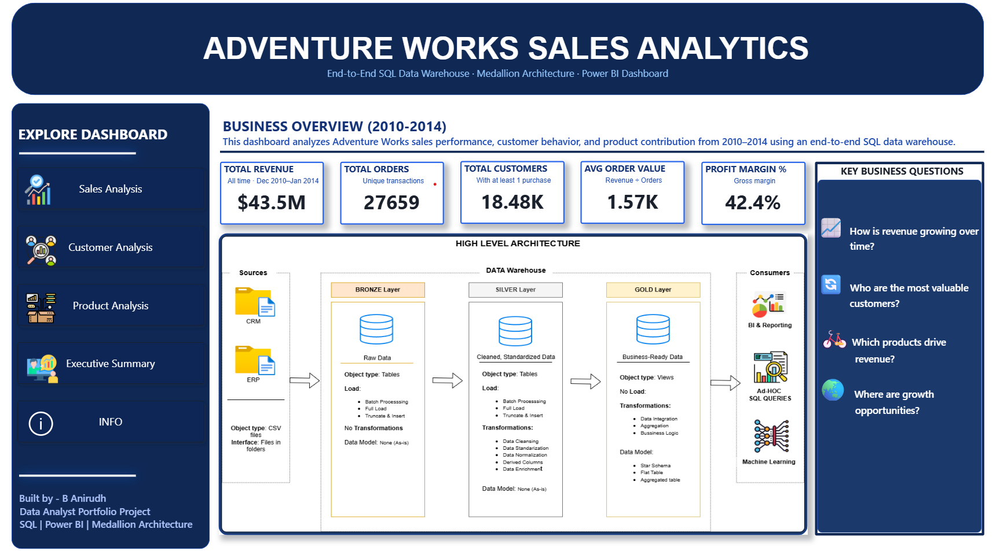
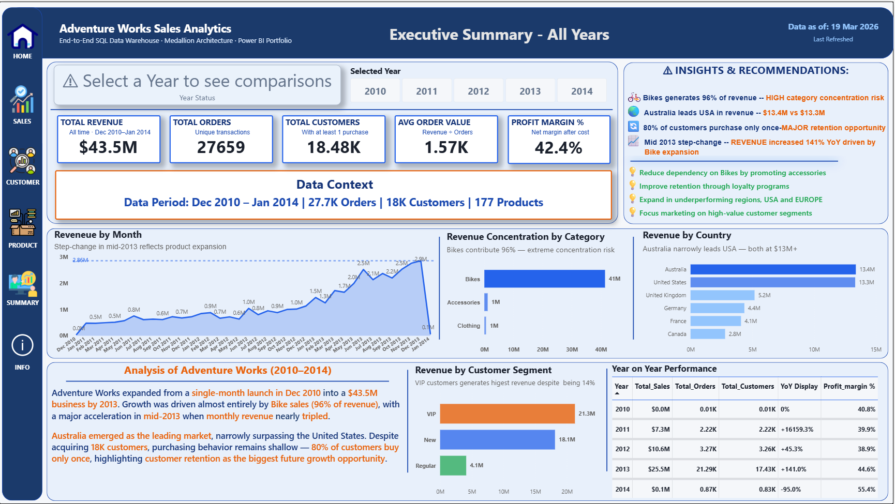

# Adventure Works Sales & Analytics Project (2010-2014)

An end‑to‑end analytics project demonstrating how raw business data can be transformed into a structured **data warehouse** and used to generate **actionable business insights**.

This project simulates a real analytics workflow followed in many organizations: from ingesting operational data to producing analytical reports and visualized through Power BI dashboards that support decision‑making.

## 🚀 Live Dashboard

🔗 [View Power BI Dashboard](https://app.powerbi.com/view?r=YOUR-LINK)

> ⚡ Interactive dashboard available above — explore filters, drilldowns, and insights in real-time.

---

## Project Overview

| Stage | Description |
|------|-------------|
| Data Ingestion | Import raw ERP and CRM datasets from CSV files |            
| Data Cleaning | Resolve data quality issues and standardize fields |
| Data Warehouse | Build structured Bronze → Silver → Gold layers |
| Analytics | Perform SQL‑based analytical queries |
| Reporting | Create analytical views for business reporting |
| BI Visualisation | Built Analytics Dashboard with insights and recomendations across the years |
| Insights | Derive business insights from the analytical results |

---

## Business Problem

Organizations collect large volumes of operational data, but raw data alone does not provide meaningful insights.

The objective of this project is to demonstrate how to:

- Organize raw data into a **structured data warehouse**
- Build **analytics‑ready datasets**
- Perform **advanced SQL analysis**
- Generate **business insights** to support decision‑making

---

## Data Architecture

The warehouse follows a layered architecture to ensure clean, reliable, and scalable data processing.


---

## Data Model

The Gold layer uses a **star schema** optimized for analytical queries.


| Table | Type | Description |
|------|------|-------------|
| fact_sales | Fact | Stores transactional sales data |
| dim_customers | Dimension | Customer attributes and demographics |
| dim_products | Dimension | Product hierarchy and attributes |

---


## 🧠 Business Questions Answered

- Which products generate the highest revenue?
- How have sales evolved over time?
- Which customer segments contribute the most revenue?
- What categories drive the majority of total sales?
- Which products are high‑performers vs low‑performers?

---

## 📊 Dashboard Preview
---
### 🏠 Home Page

Introduces the analytics solution with key metrics and explains the underlying data architecture (Medallion model and star schema) used to transform raw data into analytics-ready insights, setting the foundation for deeper analysis.


---
### 📈 Sales Analysis

In this page, we analyzed **revenue trends over time** and observed **steady growth from 2011 to 2014**, with a major breakout in **2013** where revenue increased by approximately **141% YoY compared to 2012**. The analysis also shows that this growth was primarily driven by the **Bikes category**, which dominates overall sales. Using cumulative revenue and YoY metrics, we identified **2013 as a key expansion phase** in the business lifecycle.


---
### 👥 Customer Analysis

In this page, we evaluated **customer purchasing behavior** and found that approximately **80% of customers made only a single purchase**, indicating a significant **retention challenge**. Additionally, a **small segment of high-value (VIP)** customers contributes a disproportionately **large share of total revenue**, suggesting that **improving repeat purchases and customer lifetime value** could drive substantial growth.


---
### 📦 Product Analysis

In this page, we analyzed **product performance ** and identified that the **Bikes category** contributes nearly **96% of total revenue**, highlighting a **strong dependency** on a **single product category**. While Bikes are the primary revenue driver, other categories such as **Accessories and Clothing contribute minimally**, indicating an opportunity for **diversification to reduce business risk**.


---
### 🧾 Executive Summary

This page consolidates the **overall findings**, showing that the **business grew significantly from late 2010 to 2014**, reaching approximately **$43.5M in total revenue**, with a **major growth phase in 2013**. However, the analysis also reveals key challenges, including **high revenue concentration in Bikes (96%)** and **low customer retention (80% one-time buyers)**. Based on these insights, strategic recommendations include **improving customer retention**, **increasing average order value**, and **diversifying product offerings** to ensure **sustainable long-term growth**.



---

## 💡 Business Recommendations

- Reduce dependency on Bikes through cross-selling  
- Improve retention via loyalty programs  
- Increase average order value through bundling  
- Expand in underperforming regions  
- Focus on high-value customers

---

## ⚠️ Data Limitations

- Partial data for 2010 and 2014  
- No prior year data for 2011  
- No returns/refunds data available  
- Customer segmentation is lifetime-based

---

## Project Structure

```
AdventureWorks-Sales-Analytics-project
│
├── datasets
│
├── scripts
│   ├── bronze
│   ├── silver
│   └── gold
│
├── analytics
│   ├── change_over_time_analysis.sql
│   ├── cumulative_analysis.sql
│   ├── performance_analysis.sql
│   ├── segmentation_analysis.sql
│   └── part_to_whole_analysis.sql
│
├── reporting
│   ├── customer_report.sql
│   ├── product_report.sql
│   └── sales_summary_report.sql
│
└── insights
    └── business_insights.md
```

---

## 📊 Analytical Techniques Implemented

| Analysis Type | Purpose |
|---------------|--------|
| Exploratory Data Analysis | Understand dataset structure and validate data |
| Change Over Time Analysis | Track sales trends across months and years |
| Cumulative Analysis | Monitor running totals and business growth |
| Performance Analysis (YoY / MoM) | Evaluate product performance over time |
| Data Segmentation | Group customers and products into meaningful segments |
| Part‑to‑Whole Analysis | Measure category contributions to total sales |

---

## 📑 Reporting Layer

Analytical reports were implemented as SQL views.

| Report | Key Metrics |
|------|-------------|
| Customer Report | Orders, revenue, lifespan, recency, segmentation |
| Product Report | Revenue, customers, sales performance, product segments |
| Sales Summary | Monthly sales, order trends, growth metrics |

These reports simulate the type of **datasets used by BI dashboards**.

---

## ⚙️ How to Run the Project

1. Run init_database.sql  
2. Execute Bronze layer scripts  
3. Execute Silver layer scripts  
4. Execute Gold layer scripts  
5. Run analytics queries  
6. Use reporting views for BI dashboards  

---

## Skills Demonstrated

| Category | Skills |
|---------|-------|
| Data Engineering | Data cleaning, ETL logic, layered warehouse architecture |
| SQL Analytics | Aggregations, CTEs, Window Functions, Time Analysis |
| Data Modeling | Fact & Dimension design (Star Schema) |
| Business Analysis | Customer segmentation, product performance analysis |
| Reporting | Analytical SQL views for business reporting |
| Dashboarding | Building Sales and Aanalytics charts and Dax measures |
---

## 🛠️ Tools Used
- SQL (MySQL)
- Window Functions
- Data Warehousing Concepts (Medallion Architecture)  
- DAX             
- Git & GitHub

---
---

## 👤 About Me

Hi, I'm Anirudh — an Data Analyst with ~7+ years of professional experience across aerospace manufacturing and customer operations.

I am currently transitioning into data analytics, where I combine my real-world operational experience with data-driven problem solving. Through this project, I applied data warehousing concepts, SQL analytics, and business thinking to transform raw data into actionable insights.

My goal is to leverage data to solve business problems, improve decision-making, and drive measurable impact.

📍 Based in Hyderabad, India.

🔗[LinkedIn](https://www.linkedin.com/in/anirudh-yadav-b-098231204) 
🔗[GitHub](https://github.com/Anirudhyadavv)
---

## License

This project is licensed under the **MIT License**.
